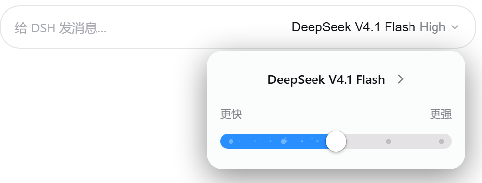
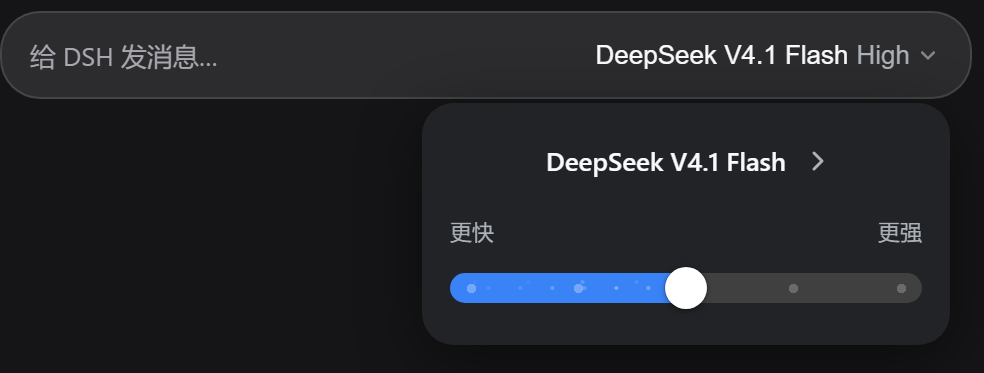
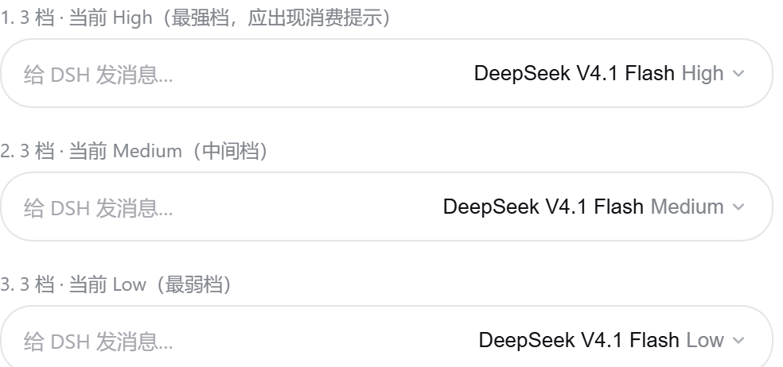

# dsh-reasoning-slider

DSH Web GUI 插件：把输入框里的**模型推理强度**换成 **Codex 桌面端的两级推理控件**。

一级只回答"现在用什么"，点击之后才出现能改的东西。形制是照着 Codex 那个控件做的，不是"看着像"：

```
[ DeepSeek V4.1 Flash High ⌄ ]      一级：模型名（主色）+ 强度名（次级灰）+ 细描边 chevron
                │ 点击
                ▼
       ┌───────────────────────────┐
       │     DeepSeek V4.1 Flash › │  二级面板：模型行（点它下钻到模型列表）
       │ 更快                 更强 │  轴标，贴着档位条两端
       │ ▬▬▬▬▬▬▬▬●▬▬▬▬▬▬▬▬▬▬▬▬▬▬  │  档位条：粗胶囊轨道 · 蓝色填充 · 轨道内刻度点 · 溢出轨道的白色圆钮
       └───────────────────────────┘
                │ 点模型行
                ▼
       ┌───────────────────────────┐
       │ DeepSeek                  │  三级：按 Provider 分组的模型列表（沿用原生那套 DOM）
       │ DeepSeek V4.1 Flash    ✓  │
       └───────────────────────────┘
```

模型选择本身仍然可用，只是入口从一级挪进了面板的模型行（`›` = 下钻）；
面板 264px 定宽（= 236px 档位条 + 两侧 14px 内边距）、圆角 16px、与触发器间距 10px，**朝上弹出，上方空间不足时朝下翻转**。
鼠标在档位条上移动时，**指针所在的那一档会浮出名字**（见「悬停读数」）。

实际渲染 —— 真 bundle + 真 React + 真 DSH 主题 token，由 `node tools/preview.mjs` 以合成 fixture 渲染
（**不是**真实会话截图；本节图片是它输出到 `dist/ui-preview/reasoning-slider/` 的原图裁剪件）：

| 亮色 · 面板打开 | 暗色 · 面板打开 |
|---|---|
|  |  |

收起态：一级只显示「模型名 + 当前档位名」，档位名跟着选择走（下图为同一模型的三档）——



> 改造前的像素级调研（Codex 官方控件怎么做的、哪些细节**不该**照搬）在
> [`tools/codex-effort-picker-spec.md`](tools/codex-effort-picker-spec.md)；本文只写落地结果与实测值。

## 形制来源与实测取值

配色与比例不是我猜的，是从 Codex 出货的那个控件上**采样**出来的
（当时的参考截图存在本地产物目录 `dist/ui-preview/reasoning-slider/reference-codex-slider-{light,dark}.png`；
那是 Codex 官方控件的截图，属第三方素材，不随本仓库发布）：

| | 亮色 | 暗色 |
|---|---|---|
| 填充 | `#298ffe` | `#3a83f7` |
| 空轨道 | `#e5e2e6` | `#404040` |
| 圆钮 | `#ffffff` | `#ffffff`（两套都是白） |
| 刻度点 | 填充色上的半透明白点（`rgba(255,255,255,.32)`） | 同上（`.3`） |

两级结构的几何同样来自采样，但 DSH 的 seat 是输入框里 28px 高的一行，放不下 Codex 的 29–36px 轨道，
所以**只保留剪影，几何按 DSH 的尺度重算**：

| 量 | Codex light | Codex dark | DSH 落地值 |
|---|---|---|---|
| 面板宽 | 267（≈ 触发器宽 268） | 337（≠ 触发器宽 183） | **264，定宽且与触发器无关** |
| 面板圆角 | ≈14 | ≈22 | **16** |
| 面板内边距 | 左右 14.5 | 左右 18–19 | **`12px 14px 14px`** |
| 面板与触发器的间距 | 12（朝上） | 14.5（朝下） | **10**（两侧同一间距） |
| 面板方向 | 输入框在窗口底部 → 朝上 | 输入框在中部 → 朝下 | **按可用空间翻转**（有实测，见「验证」） |
| 轨道宽 | 239 | 300 | **236（沿用，未改）** |
| 轨道高 / 圆钮 / 刻度点 | 29 / ⌀37 / 6–7 | 36 / ⌀40 / 6 | **15 / 21 / 4.5 = 改造前的 10 / 14 / 3 × 1.5**（整条加粗，三者一起放大） |
| 一级文本 | 模型名深 + 强度名灰，居中 | 单色，左对齐 | **模型名 `label-primary` + 强度名 `label-tertiary`，左对齐** |
| 一级箭头 | 细描边 chevron | 细描边 chevron | **10×10 内联 SVG**（原来是 `▾` 文本字形） |
| 轴标 | `Faster` / `Smarter` | 无 | **「更快」/「更强」**，11px，贴着轨道两端 |

形制上的三个关键点，也是第一版做错的地方：

1. **轨道是粗胶囊，不是细槽**（10px），且刻度**长在轨道里面**，不是外凸的标尺刻度。
2. **圆钮比轨道大**（14px），**溢出**轨道上下沿 —— 这才是 Codex 的剪影。
3. **没有彩虹**：只有一个强调蓝。像素审计里 `occupiedHueBuckets = 1`，就是这一条在把关。

档位条的构成（整条现在长在**二级面板的第二行**，宽 236px，就是面板内容宽）：

| 元素 | 含义 | 现在在哪 |
|---|---|---|
| 轨道 | 10px 高、`border-radius:999px` 的胶囊；空态用上面那张表的"空轨道"色 | 面板 |
| 刻度点 | 每个 adapter 上报的档位一个 `3px` 圆点，**垂直居中落在轨道内**；已到达的是填充色上的半透明白点，未到达的是轨道上的暗点 | 面板 |
| 填充 | 从最左端到**圆钮圆心**的实心胶囊段，`#298ffe` / `#3a83f7` | 面板 |
| 圆钮 | 14px 纯白圆点，`.5px` 极细描边 + `0 1px 3px` 投影；**两套主题都是白的** | 面板 |
| 轴标「更快 · 更强」 | 11px `label-tertiary`，`space-between` 贴轨道两端，`aria-hidden` | 面板，滑块上方 |
| 档位名 | `--dsw-alias-label-tertiary`，**一级胶囊的第二段**，不再单独占一行（面板里不重复显示，语义由 `aria-valuetext` 承担） | 一级 |
| 最强档 | 不再画任何标记（Codex 把"更贵"写在选项描述里）。提示改由 `title` 承载："最强档位：思考更充分，也更快消耗额度" —— 一级 trigger 与面板里的滑块上各有一份 | 两级 |
| 只有一档时 | **不渲染滑块**，也不渲染轴标；一级照常显示"模型名 + 该唯一档位名"（比改造前更好：旧版档位名挂在滑块右侧），面板里补一句「该模型只有一个推理档位」，否则面板看起来是空的 | 两级 |

拖动过程只改本地显示（圆钮与填充实时跟随），**松手 / 键盘抬起 / 失焦**才提交；
点击轨道任意位置可直接跳到对应档位。

## 填充上的流动粒子

填充段上有一层微粒在流动，用来说明"强度正在往上走"。

实现上刻意**不写动画循环**：两层点阵各自是一个比轨道宽一个周期的元素，
用 `transform: translateX()` 平移恰好一个周期（16px / 27px），于是首尾无缝、且整条动画
留在合成器上（没有 `requestAnimationFrame`、没有定时器、没有 canvas）。
两层周期与转速不同（1.6s / 2.9s），叠起来才有视差感而不是一条虚线。

三个必要的约束：

| 约束 | 做法 | 原因 |
|---|---|---|
| 不吃交互 | 覆盖层 `pointer-events:none` + `aria-hidden="true"` | 它压在 `input` 之上，若吃事件就拖不动了 |
| 不压住圆钮 | 覆盖层宽度 = `比例 × (轨道宽 − 圆钮宽)`，正好停在圆钮左缘 | 否则粒子会画到白色圆钮上 |
| 可关闭 | `@media (prefers-reduced-motion:reduce)` 直接 `animation:none` | 动效不该对前庭敏感的用户强制播放 |

另外两个边界：**最弱档不渲染粒子**（填充只有 7px，塞进去只是噪点，判据是 `FLOW_MIN_WIDTH = 24`，判据本身没动，
只是宽度基数从 `142 − 14` 换成 `236 − 14`：3 档时中间档从 64px 变成 107.5px，仍然渲染）；
**会话锁定时暂停**（`animation-play-state:paused`），因为此时整个 seat 本来就是惰性的
（锁定时一级 `disabled`、面板打不开；若面板恰好在锁定前已打开，暂停仍然生效）。

### 逐粒子闪烁（2026-09：让粒子各自明灭）

上面那段描述的是**只有流动**的版本。现在每层再配一条**半周期错位的副梳**，
让相邻粒子恒处于明灭周期的两端——一颗粒子亮、紧挨着的那颗暗，而不是整片一起亮暗。

做法（下面这些数字都被 `tests/flow-flicker.test.mjs` 钉住）：

| | 载波周期 | 副梳偏移 | 合成净点距 | 漂移时长（保线速度） | 闪烁时长 |
|---|---|---|---|---|---|
| A 层 | 32px | `left:16px` | **16px（与改动前逐点相同）** | 3.2s / 32px = 10.0 px/s | 2.15s |
| B 层 | 54px | `left:27px` | **27px（同上）** | 5.8s / 54px = 9.31 px/s | 3.45s |

* 副梳是 `.drs-flow::before` / `.drs-flow::after`，**没有新增 DOM**（覆盖层仍是两个 `span`）。
  它们必须挂在**容器**上：挂在被动画的那一层里，父层的组透明度会乘进来，
  而两梳反相 ⇒ `0.5 × 1 == 1.0 × 0.5`，闪烁会被**精确抵消**（这是实测抓到的 bug，见下）。
* 两梳共用同一条 `@keyframes drs-flow-twinkle` / `-alt`（互为镜像），
  且**时长与延迟完全一致** ⇒ 反相是精确的、不随时间漂移；两条车道用不同节拍（2.15s vs 3.45s）⇒ 整场找不到同一个拍子。
* **只变暗、不变亮**：主梳 alpha 仍是 `.55`，副梳 `.42` / `.24`，暗相 `opacity:.5` 而不是 0
  ⇒ 任何瞬间最亮的白点都不超过改动前的峰值，也不会出现"粒子凭空消失"。
* 逃生口一并扩大：reduced-motion 与锁定 seat 的规则现在覆盖两条副梳（`.drs-flow::before`/`::after`，以及 `.drs-flow--idle::before`/`::after`）。

> 验证方式不是"看起来在闪"：`tools/flow-flicker.mjs` 把无头 Chrome 的动画暂停并 seek 到指定
> `currentTime` 后逐帧截图，再自写 PNG 解码做两种口径的测量——**同位置成对帧**
> （取"位移正好整数个净点距"的 Δt，几何重合，同一 x 的亮度差只剩 opacity 动画）与**逐粒子追踪**。
> 四组实现（含"现状"对照）的读数：现状 幅度 1.07（地板）· P1 整层呼吸 同相度 0.92、反相对 0/7
> （正是要避免的"整层脉冲"）· **本实现 幅度 12.5（11.6× 地板）、同相度 0.165、反相对 3/7** ·
> 步进超胞方案 反相对 6/10 但流动变成每 800ms 跳一格。
> 真实时钟探针：96 个动画 `playState=running`、96/96 在 913ms 真实时间里 `currentTime` 推进。
> 原始矩阵、逐帧 PNG、1× 与 4× 条带截图、provenance（页面/驱动 md5 + 逐帧 md5 + 时间）都在
> `dist/ui-preview/reasoning-slider/flow-flicker/`（本地产物，跑一次 `node tools/flow-flicker.mjs` 重新生成，不进仓库）；
> 候选对比与选型理由在 `tools/flow-flicker-prototype.md`。

> 验证方式不是"看起来在动"：连上真实 GUI 读 Web Animations API ——
> `playState: "running"`、`currentTime` 567→983、两层 `transform` 分别从 -5.67/-5.28
> 走到 -9.83/-9.15（速率不同 ⇒ 视差成立）。

## 悬停读数

指针在档位条上移动时，**最近的那一档会把名字浮在条上**：

```
          +------+
 更快     | Low  |     更强      ← 读数：指针在哪一档，就显示哪一档的名字
   ▬▬▬▬▬▬▬▬●▬▬▬▬▬▬▬▬▬▬▬▬▬▬▬
```

* **认的是位置，不是像素。** 档位中心来自 `stopCenter(i, n, width)` —— 和刻度点、填充用的是**同一个换算**，
  所以读数不可能落到别的档上。原生 range 不提供“每一档”的事件，所以实现是自己按指针 x 找最近的档位中心。
* **只是读数，不是选择。** 移动指针不提交任何东西（提交仍在松手 / 键盘抬起 / 失焦），扫过整条不会误改强度。
* **不吃指针事件**（`pointer-events:none`），拖动照旧。
* **位置写成 `calc()` 而不是 px 常量**：`clamp(52px,calc(7px + ratio × (100% - 14px)),calc(100% - 52px))`
  —— 与 `stopCenter()` 同一条线性映射，但在面板被窄视口夹窄（`min(264px,100vw - 32px)`）时也成立；
  `clamp` 让两端的档位名不会溢出条外。
* **离开就收起**：`onPointerLeave` 清空；面板关闭或切到模型列表也会清空，重新打开不会残留上次的档位名。
* 只有一档时没有条，也就没有读数。

配色沿用浮层 token：底 `--dsw-specific-menu`、字 `--dsw-alias-label-primary`、
外圈是 `--dsw-alias-border-l3` 的 1px 描边 + 投影 —— 亮色主题下三层表面都是 `#fff`，
只靠填充分不出层次，所以描边是必需的（这条是先查 `tools/preview/dump-tokens.mjs` 再定的，不是猜的）。

## 安装

前置条件：一个可用的 DSH 运行时，以及目标 profile（`--profile <name>`）。
本插件不引入任何第三方运行时依赖 —— 浏览器半边只 `require("react")`，那是平台冻结表里的基线模块。

```bash
node scripts/deploy.mjs --profile web    # 幂等，可反复执行
# 然后刷新页面即可（profile patch 层是热监听的，无需重启）
```

脚本做三件事：

1. 把包复制进 `<DSH_HOME>/profiles/web/node_modules/`，让 Cordis Loader 能解析这个包名；
2. 在 profile manifest 的 `dependencies` 写入 `"dsh-reasoning-slider": "link:<本目录>"`——
   这是给**将来**的 `pnpm install` 用的保底：届时 pnpm 会把手工副本换成指回本目录的软链，
   而不是把它当多余目录清掉；
3. 往 profile 的 `cordis.patch.yml` 追加一条 `insert`（原文件会先备份成
   `cordis.patch.yml.bak-dsh-reasoning-slider`）。

> 若 profile 的 `node_modules/dsh-reasoning-slider` 已经是指回本目录的**软链**（`link:` 依赖装好后就是），
> 改 `lib/client.js` 后刷新页面即可生效，不需要再跑 deploy。

### 为什么不走 `dsh.profile.bundles`

`dsh.profile.bundles` 是**启动时读一次**的层列表，改它必须重启；
而 profile 的 `cordis.patch.yml` 是**被监听的用户 patch 层**
（`watchUserPatches` + `DEFAULT_PROFILE_PATCH_RELOAD = "live"`）。
改这个文件会事务性地重新应用到 boot include，于是：

```
cordis.patch.yml 变更 → loader entry 热加载 → client-modules 增量扫描
                     → boot graph 重算 → 刷新页面即生效
```

> ⚠️ **注册只能二选一。** 本包同时声明了 `dsh.bundle.patch`（官方 bundle 形态），
> 因此若改用 `dsh plugin --profile web add <本目录>`，dsh 会把包名加进
> `dsh.profile.bundles`，届时**必须先删掉 profile patch 里那段 `insert`**，
> 否则插件树里会出现两个同名 entry。

### 卸载

1. 删除 profile `cordis.patch.yml` 里以 `# ── dsh-reasoning-slider` 开头的那一段；
2. 删除 profile `package.json` 的 `dependencies["dsh-reasoning-slider"]`；
3. 删除 `<DSH_HOME>/profiles/web/node_modules/dsh-reasoning-slider/`；
4. 刷新页面（patch 层热重载后原生 seat 立刻回来）。

## 它替换了什么

`conversation.input.model` 是 `ui-conversation` 声明的 **single / session** 槽位，
默认由 `@deepseek-ai/dsh-client-ui-model-selection` 以 priority `0` 占用。

`SlotCore.register` 对**同一 priority 的重复占用会直接抛错**，所以本插件以
priority `-1` 注册（"lowest renders" ⇒ 由本插件胜出）。两个 occupant 都读写
**同一个** `ModelDirectory`（`ctx.modelDirectories.directoryFor(sessionId)`），
因此 `/model` 命令弹窗与本插件显示的永远是同一份选择。

## 目录结构

| 路径 | 作用 |
|---|---|
| `package.json` | `dsh.bundle.patch` + `dsh.client.platform: "web"` + `exports["./client"]` |
| `cordis.patch.yml` | 本包自带的 profile 层（`dsh.profile.bundles` 路径下的形态） |
| `lib/index.js` | Host 半边：刻意空实现，只为让包出现在 Loader 入口表（客户端扫描只看那里） |
| `lib/client.js` | 浏览器 bundle（手写 `window.__ModuleLoader__.load` 工厂，只 `require("react")`） |
| `tests/bundle.test.mjs` | bundle 形状 + 组件行为契约（mini React 驱动真实 bundle） |
| `tests/slot-contract.test.mjs` | 用**真实 `SlotCore`** 验证 shadow、优先级冲突、可回滚 |
| `scripts/deploy.mjs` | 部署脚本 |
| `tools/preview.mjs` | 无头 Chrome 截图装置：真 React + 真主题 token 渲染 state 矩阵 + 像素审计 |
| `tools/preview/harness.js` | 装置页面里的装配代码（拿真实注册路径喂 fixture） |
| `tools/preview/pixels.html` | 把 PNG 画进 canvas，统计"高饱和像素数 / 色相桶数 / 平均饱和度" |
| `tools/preview/dump-tokens.mjs` | 从主题包里导出 `--dsw-alias-*` 在明暗两套下的真实取值（选 token 前先查它，别猜） |
| `tools/preview/baseline/client.before.js` | 改造前的 bundle 快照，供 before/after 对比（只读） |
| `tools/codex-effort-picker-spec.md` | 两级改造前的像素级调研规范（映射表 / 推荐尺寸 / 不该照搬的 10 条） |
| `tools/verify-report.md` | 各轮独立校验报告与截图证据（两级改造那一轮补在文末） |

## 为什么这样写

* **不崩溃优先。** 插件只等待 `slots` / `modelDirectories` / `sessions` 三个服务
  （`ctx.inject`）。任一服务缺席时注册根本不会发生，原生 seat 照常渲染；
  注入面在所有失败路径上都退化为 `available: false` 而绝不抛错；
  组件外面套了 error boundary，渲染期异常只会让这个 seat 变空。
* **不引入外部模块。** bundle 只 `require("react")`（平台冻结表之一），
  因此 `dsh.client` 不需要 `external`，组合阶段没有任何可失败的请求。
* **提交时机。** 拖动过程只更新本地显示，松手 / 键盘抬起 / 失焦才调用
  `select({provider, model, reasoningEffort})`；与当前值相同的档位不会发起请求。
* **档位顺序** 直接采用 adapter 上报的 `reasoning.efforts` 顺序；
  当 adapter 未声明默认档（`defaultEffort === undefined`）时，最左端额外插入"默认"档
  （提交时省略 `reasoningEffort` 字段）。
* **刻度位置不能用百分比。** 原生 range 的圆钮行程是 `宽度 - 圆钮宽`，还内缩半个圆钮，
  所以按 `ratio × 100%` 摆刻度点会在最强档整整偏 7px。`stopCenter(level, count, width)` 是这段换算的
  唯一出处——**宽度是参数而不是写死在函数里的常量**（面板把它换成 236，函数本身不认识面板），
  刻度点、填充、以及 `lib/client.js` 顶部的几何常量一起保证 CSS 与生成的图层不会各说各话。
* **配色是采样来的，不是主题 token 推导来的。** 第一版用 `--dsw-alias-*` 做"中性单色"，
  结果与 Codex 毫无关系——Codex 那个控件本来就是**有强调蓝**的。
  现在填充/空轨/刻度点三组色值写在 `.drs-range` 上、由 `body[data-ds-dark-theme]` 覆盖，
  值直接来自对出货控件的取样；圆钮两套主题都是纯白。
  菜单与文字仍然走 DSH 主题 token，所以外围观感不脱离 DSH。

## 验证

```bash
# 契约与行为（三个文件）
node --test tests/bundle.test.mjs tests/slot-contract.test.mjs tests/flow-flicker.test.mjs

# 粒子闪烁的逐帧证据（自带无头 Chrome 驱动，用自己的 .flow-work，不碰 .preview-work）
node tools/flow-flicker.mjs

# 视觉：真浏览器渲染 + 截图 + 像素审计 + 悬停读数 + 焦点去向
# （每套主题 4 张：收起态矩阵 / 面板 / 面板朝下 / 模型列表，交互态都是真点击）
node tools/preview.mjs --label after3
node tools/preview.mjs --bundle tools/preview/baseline/client.before.js --label before

# 端到端：连正在跑的真实页面（token 从 ~/.dsh/logs/web-silent.log 取，只读）
node tools/live-gui-check.mjs --label final
```

产物写到 `<repo>/dist/ui-preview/reasoning-slider/`：

| 图 | 抓什么 | 怎么进入这个态 |
|---|---|---|
| `after3-{light,dark}.png` | 收起态 10 行矩阵（含超长模型 id 与 locked） | 不点（无 query） |
| `after3-{light,dark}-panel.png` | 二级面板，朝上弹出 | 真点击 trigger（`?panel=1`） |
| `after3-{light,dark}-panel-down.png` | 二级面板，朝下翻转 | 同上 + `&dir=down`（把 seat 放到页面顶部） |
| `after3-{light,dark}-menu.png` | 三级模型列表 | 真点击 trigger → 模型行（`?menu=1`） |
| `after3-{light,dark}-focus.png` | 关闭路径的焦点去向（截图是副产物，证据在 `*.focus`） | 点击开 → Esc → 再点开 → 外部 mousedown（`?focus=1`） |

配套 `*.facts.json`（解析后的 CSS 事实：一级两段文本与颜色、caret 是不是 SVG、有没有被截断、
面板的 side/尺寸/圆角/内边距/轴标文案、滑块的图层与几何）与 `*.pixels.json`（色彩统计）。

**悬停读数也是硬断言**：装置用真 `PointerEvent` 依次移到每一档中心，读回 `*.hover`
（每档自己的名字、读数中心与档位中心的偏差、离开后是否收起），并且
**指针停在当前档上时读回的名字必须等于滑块的 `aria-valuetext`** —— 这条自洽检查不需要 fixture 知识。
两个实测的坑：React 18 会批处理事件产生的 state，`dispatchEvent` 返回时 DOM 还没更新，
读数必须晚一个 tick 再读；而 `onPointerLeave` 是 React 从 `pointerout` 合成的（leave 不冒泡、不被委托），
所以“让指针离开”要发 `pointerout`。

**像素审计只对 `-panel` 那一张跑**：收起态根本没有档位条，唯一能看见强调蓝的地方就是面板里的滑块。
面板朝下那张不跑审计，脚本会先删掉同名旧文件——否则旧证据会冒充这次的测量。
每份 JSON 都带 `provenance`（bundle 路径 + md5 + 时间），因为仓库不是 git 仓库，
没有指纹的话旧文件会冒充新证据；像素审计取不到数据时脚本**直接失败退出**，而不是只 warn。

像素审计把截图裁到**每一行的控件框**再统计（面板打开时是档位条，收起态是 trigger），
并用 `--disable-lcd-text` 关掉文本次像素渲染——否则字形边缘的彩色描边会淹没有效信号。
四代实现的实测（同一装置、同一 fixture）：

| 版本 | 高饱和像素 | 色相桶 | 平均饱和度 | 判读 |
|---|---|---|---|---|
| 第一版蓝→橙渐变 | 24261 / 129844（18.7%） | **7** | 0.2293 | 七色相彩虹 |
| 第二版中性刻度条 | 0 / 112596 | 0 | 0.0245 | 无彩虹，但形制与 Codex 无关 |
| 第三版 Codex 档位条（常驻在一级） | 19165 / 110924（17.3%） | **1** | 0.1826 | 有强调色，但只有**一个**色相 |
| 第四版 两级（档位条搬进面板） | 4435 / 20768（21.4%） | **1** | 0.2265 | 裁剪框更小更准，仍然只有**一个**色相 |
| 第四版 收起态矩阵（10 个 trigger 框） | 0 / 215656 | 0 | 0.0124 | 摘要胶囊上**一点强调色都没有**（一级不画档位图形） |
| 第五版 档位条加粗 1.5×（15px 轨道 / 21px 圆钮） | 6440 / 27376（23.5%） | **1** | 0.249 | 加粗后仍是**单一强调蓝**（读数气泡的灰阶不贡献色相）；裁剪框随之变小变准 |

**`occupiedHueBuckets` 才是这里的关键指标，不是高饱和像素数**：第三版的高饱和像素占比
和第一版几乎一样（都是 ~17–18%），单看这个数会以为"没改"。真正区分"一个强调蓝"和
"七色相彩虹"的是色相桶数量（1 vs 7）。

两点读法上的诚实说明：

* `occupiedHueBuckets` 由高饱和像素派生，`vivid = 0` 必然推出 `hues = 0`（第二版就是这种情形），
  **它不是独立于 vivid 的第二份证据**。
* 阈值只对"有没有强色相"有效；深灰的抗锯齿边缘本身带一点点彩度，别把结论说成"逐像素无彩度"。

### 覆盖边界（别把绿当成全绿）

* **Firefox 未实测。** 装置只驱动 Chromium/Edge；`::-moz-range-*` 那几条规则是按同一套几何写的，
  且显式把 `::-moz-range-progress` 置为透明（Firefox 会自己画一条原生进度条，会和填充层叠色），
  但这只是代码推演，没有证据。
* **两个打开态在单测里的可达性，是用一个"仅测试用"的 props 换来的。** `tests/bundle.test.mjs` 的迷你渲染器
  是单趟遍历、`useState` 不触发重渲染，所以 `view !== 'closed'` 在单测里**结构上到不了**。
  Seat 因此接受一个 **test-only** 的 `initialView` prop；注入面 `faceFor` 永不传它，
  生产路径恒为 `'closed'`，与改造前字节等价。真实渲染由 `node tools/preview.mjs` 的
  `*-panel.png` / `*-panel-down.png` / `*-menu.png` 覆盖（真点击）。
* **焦点：打开进面板、关闭回 trigger，两头都在装置里实测过，但没在真实 GUI 里点过。** 面板打开时焦点进面板
  （`role="dialog"` + `tabindex="-1"`），模型列表打开时进第一个选项（Esc 因此一定可达：列表 → 面板 → 关闭，逐级退）；
  关闭时（Esc / 选中模型 / 点 trigger 收起）焦点**还给 trigger**，只有"点外部"这条路径不抢焦点。
  实测在浏览器装置里读 `document.activeElement`：
  `after-open=panel/.drs-panel → after-escape=closed/trigger → after-reopen=panel/.drs-panel → after-outside-mousedown=closed/body`。
  这条测量顺带抓出一个真 bug：面板首帧是 `visibility:hidden`（位置在 layout effect 里量），而隐藏元素**收不到焦点**，
  所以只按 `view` 依赖的 focus effect 一直是空转——现在依赖里加了"已定位"这一项。
  仍未覆盖：真实输入框在面板打开期间会失去键盘焦点（ChatGPT 的弹出层同样如此），这一条没有端到端验证。
* **`?dir=down` 是"制造上方空间不足"**（把 seat 挪到页面顶部），验证的是翻转判据与 clamp，
  不是某个具体窗口尺寸下的表现；真实 GUI 里 seat 在输入框一行、通常在窗口下半部，大概率朝上。
* **端到端点验未做（本文件作者）。** 真实 GUI 需要鉴权，作者那一轮没连上；本仓库另有只读的
  `tools/live-gui-check.mjs` 驱动真实页面，那一轮结果不在本文件里。

```bash
dsh --profile web --dump-config    # 只组合配置、不启动服务
```

## 许可证

MIT —— 见 [LICENSE](LICENSE)。
